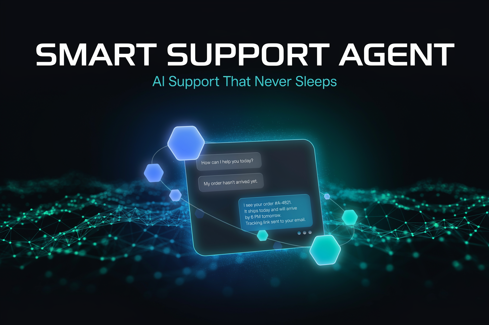

<div align="center">



# 🧠 Smart Support Agent

**AI-powered customer support that actually understands your customers**


*AI Accelerate Hackathon*

</div>

<br/>

Smart Support Agent is an AI-powered customer support system that combines hybrid search with large language model generation to deliver accurate, contextual answers to customer queries. It indexes a SaaS support knowledge base in Elastic Cloud and uses Google Cloud Vertex AI (Gemini Pro) to synthesize responses — so customers get precise, conversational help instead of a wall of links.

## ✨ Features

- **Hybrid Search** — Combines keyword and vector search via Elastic Cloud for high-relevance knowledge base retrieval
- **Generative Responses** — Gemini Pro synthesizes retrieved context into natural, conversational answers
- **React Chat Interface** — Clean, real-time chat UI for end-users to submit and receive support replies
- **FastAPI Backend** — Lightweight Python API layer connecting search, AI, and the frontend
- **Knowledge Base Ready** — Ships with a sample CloudFlow SaaS support dataset to demonstrate out-of-the-box
- **Contextual Understanding** — Queries are semantically matched, not just keyword-matched, reducing irrelevant results

## 🎥 Demo

[](https://www.youtube.com/watch?v=iza39EIaGSc)

## 🛠️ Tech Stack

| Layer | Technology |
|---|---|
| Search | Elastic Cloud (hybrid keyword + vector search) |
| AI / LLM | Google Cloud Vertex AI — Gemini Pro |
| Backend | Python FastAPI |
| Frontend | React |
| Data | CloudFlow SaaS sample support knowledge base |

## 🚀 Getting Started

```bash
# 1. Configure Elastic Cloud
#    Set ELASTIC_CLOUD_ID and ELASTIC_API_KEY in your environment

# 2. Set up Google Cloud project
#    Enable Vertex AI and set GOOGLE_APPLICATION_CREDENTIALS

# 3. Install dependencies
pip install -r requirements.txt

# 4. Start the agent
python main.py
```

## 📄 License

MIT
